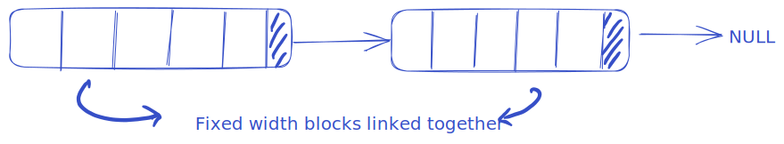

# Threading Library
---

- A simple threading library for learning purpose.
- Uses C++23 but, should be fine with 20 as well. Update `CMakeLists.txt`
- compiler: `clang++`
- build manager: `cmake`
- package manager: `conan`
- testing framework: `catch2 v3`
- important compiler options: `-ggdb3`, `-fsanitize=undefined,address`
- debug using: `gdb`

### Features

1. [ds::ConcurrentStdQueue](./src/include/concurrent_std_queue.h) : thread-safe, unordered* queue using `std::queue`. 
    - e.g. `ds::ConcurrentStdQueue<int> sq;`
2. [ds::ConcurrentBlockQueue](./src/include/concurrent_block_queue.h) : thread-safe, unordered*, custom queue. 
    - with `BLOCK_SIZE=1`, it's essentially a queue based on singly linked-list. default is `BLOCK_SIZE=512`
    - e.g. `ds::ConcurrentBlockQueue<int,1> bq;`

\* unordered = you can't decide priority. the order is maintained once entered in the queue.

### Build

1. Manually setup: cmake, conan, clang, gdb
2. run `$ ./setup.sh`

### Test

1. run `$ make test`

### TODO
- Add more features, like thread pool, concurrent cache, lock free queue etc.
- Setup environment in a dockerfile.
- Add github actions.
