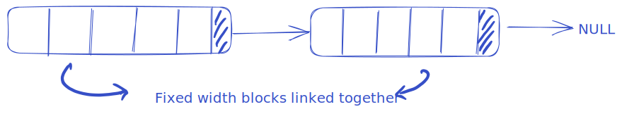

# threading library

A simple threading library written in C++20 that is header-only.
The intent is to provide a starting point for a concurrent code.

***Copy the `Library/Includes` directory into your project or add it to your include path to use it.***

### features

- [data structures](#data-structures)
    - [concurrent hashmap](#concurrent-hashmap)
    - [concurrent block queue](#concurrent-block-queue)
    - [synchronized queue](#synchronized-queue)
    - [concurrent stack](#concurrent-stack)
- [utilities](#utilities)
    - [function wrapper](#function-wrapper)
    - [async result](#async-result)
    - [threadpool](#thread-pool)
    - [spin lock](#spin-lock)

#### DATA STRUCTURES <a name="data-structures"/>

##### [DataStructures::ConcurrentHashMap](./Library/Includes/DataStructures/ConcurrentHashMap.hpp) <a name="concurrent-hashmap"/>
- bucket-level locking based, concurrent hash map.
- number of buckets can be adjusted with a template parameter, default is `BUCKETS=1031`.
- below example creates a hash map with (key=std::string, val=double, buckets=517)
- usage : `DataStructures::ConcurrentHashMap<std::string,double,517>`

##### [DataStructures::ConcurrentBlockQueue](./Library/Includes/DataStructures/ConcurrentBlockQueue.hpp) <a name="concurrent-block-queue"/>
- fine-grained locking, FIFO-queue. 
- with `BLOCK_SIZE=1`, it's essentially a queue based on singly linked-list. default is `BLOCK_SIZE=512`
- unless necessary, push & pop can work independently without blocking each other.
- usage :  `DataStructures::ConcurrentBlockQueue<std::string,256> bq;`

##### [DataStructures::SynchronizedQueue](./Library/Includes/DataStructures/SynchronizedQueue.hpp) <a name="synchronized-queue"/>
- coarse-grained synchronized FIFO-queue, implemented using `std::deque`
- blocks the whole structure for both push & pop.
- usage: `DataStructures::SynchronizedQueue<std::string> sq;`

##### [DataStructures::ConcurrentStack](./Library/Includes/DataStructures/ConcurrentStack.hpp) <a name="concurrent-stack"/>
- lock-based bounded( `container: std::vector` ) and unbounded( `container:std::deque` ) LIFO structure.
- since, only one point of access, no option other than locking the whole structure is available.
- usage [bounded stack]   : `DataStructures::ConcurrentStack<value_type,bound_size>`
- usage [unbounded stack] : `DataStructures::ConcurrentStack<value_type>`

#### UTILITIES

##### [Utilities::FunctionWrapper](./Library/Includes/Utilities/FunctionWrapper.hpp) <a name="function-wrapper"/>
- a type erased function wrapper
- usage : `Utilities::FunctionWrapper{ callable };`

##### [Utilities::AsyncResult](./Library/Includes/Utilities/AsyncResult.hpp) <a name="async-result"/>
- a wrapper over `std::future` that allows chaining of callbacks once the result is available.
- usage : `Utilities::AsyncResult<callback_return_type> result;`
- usage [chaining] : `auto final_result = result.then( f ).then( g ).then( h ).get( );`

##### [Utilities::ThreadPool](./Library/Includes/Utilities/ThreadPool.hpp) <a name="thread-pool"/>
- a thread pool with customisable number of worker threads.
- default pool size is determined by `std::thread::hardware_concurrency( )`.
- worker threads busy-waits for work.
- task submission returns a `Utilities::AsyncResult<callback_return_t>` object.
- usage : `Utilities::ThreadPool tp(20);`
- usage [submit task] : `auto result = tp.submit( callable );`

##### [Utilities::SpinLock](./Library/Includes/Utilities/SpinLock.hpp) <a name="spin-lock"/>
- a busy-waiting exclusive lock.
- compatible interface with `std::lock_guard<T>` & `std::unique_lock<T>`.
- usage : `Utilities::SpinLock lock;  std::lock_guard<Utilities::SpinLock> guard(lock);`

### build

- build and tool usage are documented in [Docs/Build.md](./Docs/Build.md)
- example target: `threading_library_smoke_app`
- test target: `threading_library_tests`
- generated documentation uses [Docs/Doxyfile](./Docs/Doxyfile)
- static assets now live under [Docs/Resources](./Docs/Resources)

### test

1. run `make test`
2. or run `ctest --test-dir _build/debug --output-on-failure`

### todo
- [ ] lock free data structures stack, queue & cache.
- [ ] concurrent algorithms like zip.
- [ ] utilities like guarded resource, spin lock, seqlock, ticket lock.
- [ ] homogenize container interface using concepts.
- [ ] add github actions.
- [ ] add benchmark.
- [ ] improve documentation e.g. add code examples etc.
